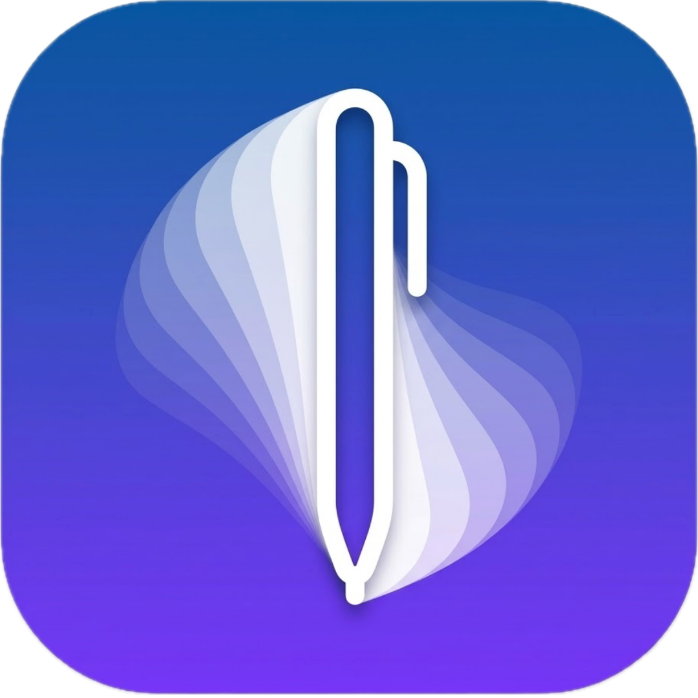
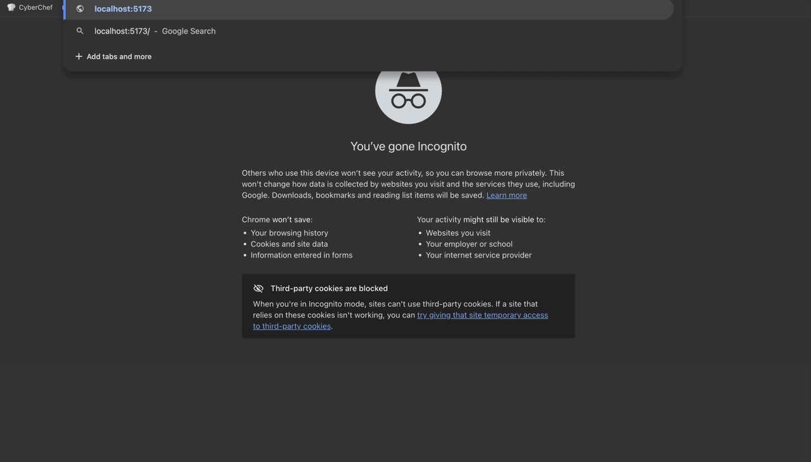
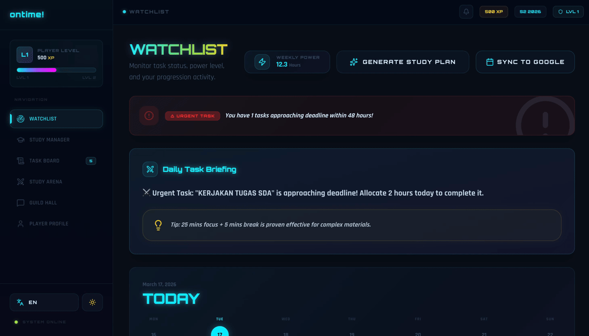
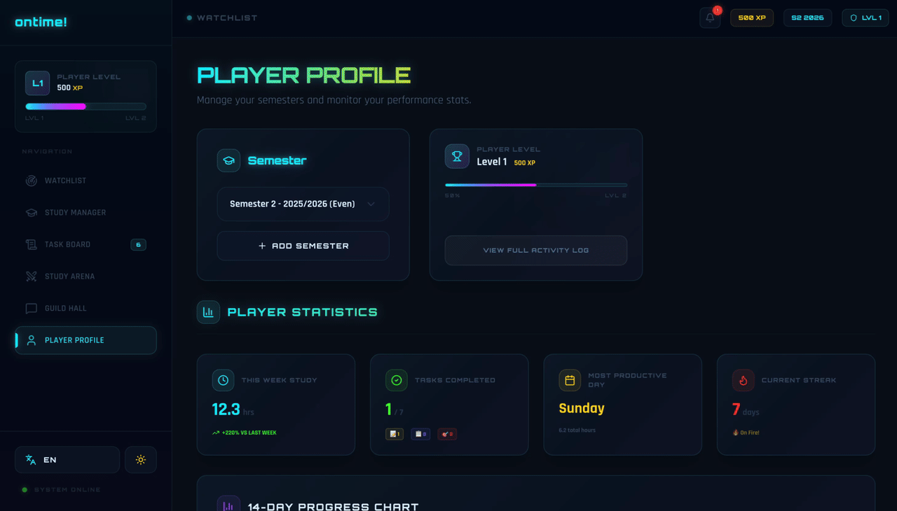
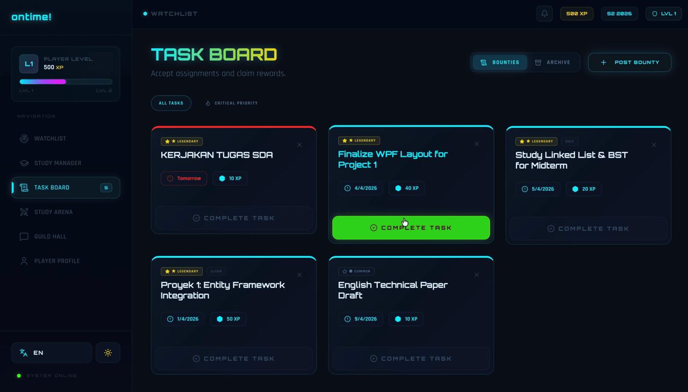
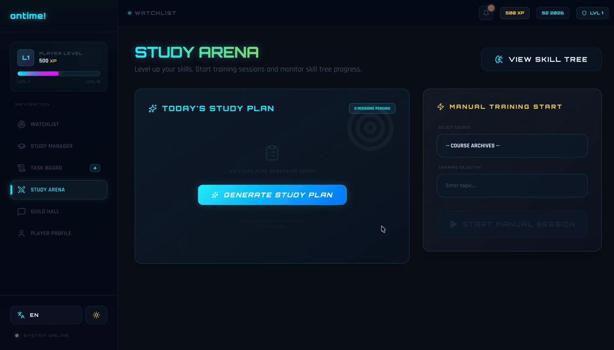
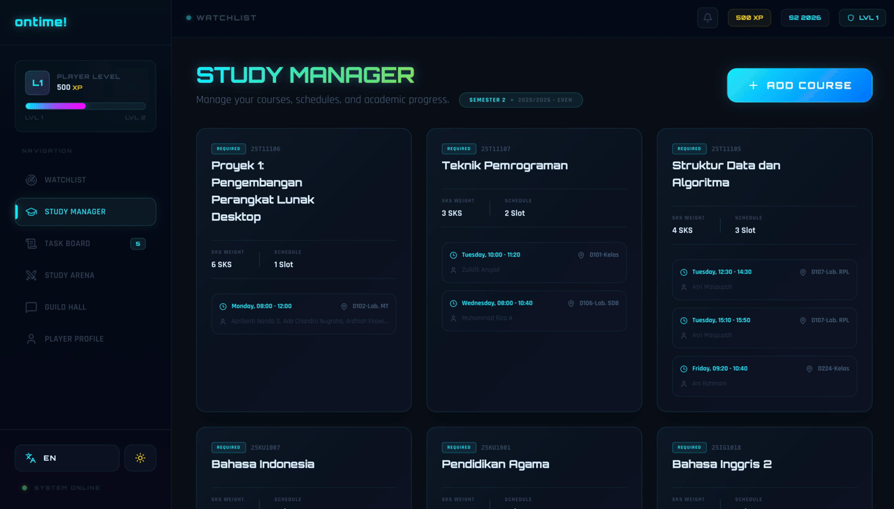
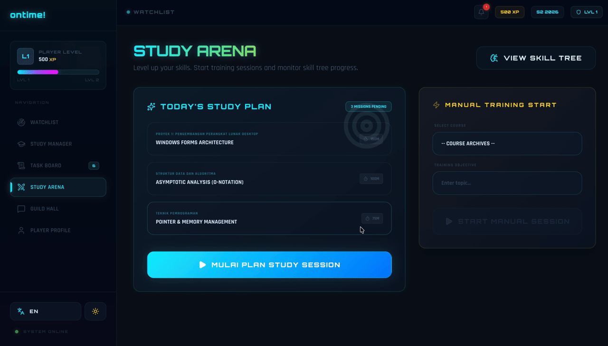
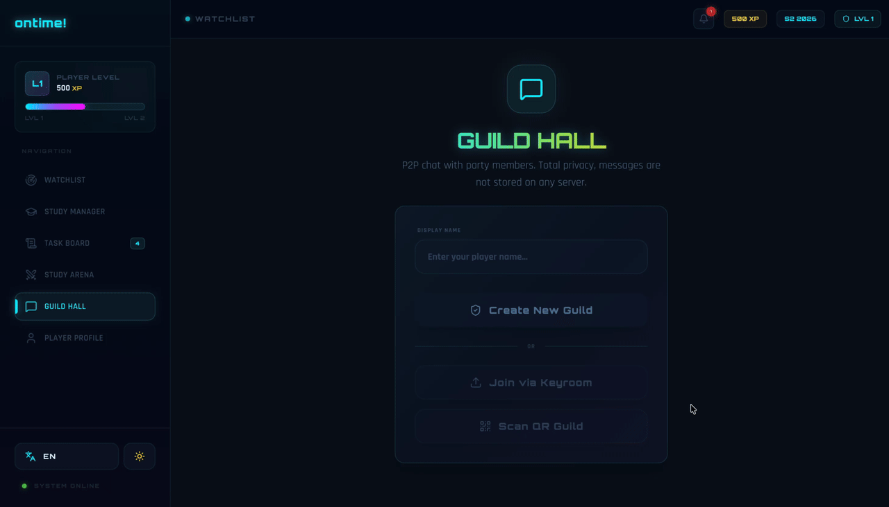

# ontime! — Gamified Academic Productivity Hub



> **Nama Website:** ontime!
> **Nama Tim:** Crownless Monarch
> **Kompetisi:** Web Design Competition (WDC) — iFest #14, Universitas Atma Jaya Yogyakarta

## Deskripsi Singkat

**ontime!** adalah website produktivitas akademik bergaya gamifikasi RPG yang dirancang khusus untuk mahasiswa. Website ini mengubah rutinitas pengelolaan tugas, jadwal, dan waktu belajar menjadi pengalaman interaktif layaknya sebuah permainan. Melalui sistem Experience Points (XP), leveling, dan visual feedback yang dinamis, **ontime!** memotivasi pengguna agar lebih konsisten dan terorganisir dalam menjalani kehidupan perkuliahan.

Dengan pendekatan _frontend-only_ tanpa backend tradisional, seluruh data tersimpan secara lokal di perangkat pengguna menggunakan Zustand dengan persistence middleware, sehingga website dapat berjalan cepat, ringan, dan andal.

## Daftar Isi

- [Daftar Fitur Utama](#daftar-fitur-utama)
- [Penjelasan Fitur & Cara Penggunaan](#penjelasan-fitur--cara-penggunaan)
- [Daftar Halaman](#daftar-halaman)
- [Cara Menjalankan](#cara-menjalankan)
- [Arsitektur Teknis](#arsitektur-teknis)
- [Struktur Repositori](#struktur-repositori)

---

## Daftar Fitur Utama

**ontime!** memiliki **5 fitur utama** yang mendukung produktivitas mahasiswa:

| No. | Fitur | Fungsi Utama |
| --- | --- | --- |
| 1 | **Dashboard** | Pusat kendali untuk memantau tugas, jadwal, dan rencana belajar |
| 2 | **Task Board** | Pengelolaan dan pencatatan tugas akademik (note-taking & task management) |
| 3 | **Skill Tree** | Visualisasi kurikulum dan pengaturan aktivitas belajar per mata kuliah |
| 4 | **Study Arena** | Pengelolaan waktu belajar dengan focus timer dan pelacakan sesi |
| 5 | **Guild Hall** | Kolaborasi dan diskusi kelompok secara real-time (peer-to-peer chat) |

---

## Penjelasan Fitur & Cara Penggunaan

Sebelum memasuki halaman utama, pengguna akan disambut oleh **System Boot**, sebuah sekuens loading sinematik bergaya retro-futuristik. Animasi ini menampilkan hex-grid parallax, partikel geometris mengambang, dan efek scanline bertema CRT yang langsung membawa pengguna ke dalam atmosfer dunia ontime!.



Setelah masuk, seluruh fitur tersaji dalam lima hub utama:

### 1. Dashboard

Pusat kendali utama yang menyajikan ringkasan lengkap aktivitas akademik pengguna. Di dalamnya terdapat **Watchlist** yang menampilkan tugas-tugas mendesak, jadwal kuliah terdekat, serta notifikasi terbaru. Dashboard juga dilengkapi dengan fitur pembuatan rencana belajar berbasis AI dan sinkronisasi otomatis ke Google Calendar. Ringkasan profil yang menampilkan XP, level, serta streak aktif selalu terlihat, sementara grafik aktivitas mingguan yang interaktif memungkinkan pengguna melacak tren penyelesaian tugas dan pola belajar secara sekilas.


*Widget Watchlist dalam halaman Dashboard*


*Ringkasan profil dan grafik mingguan yang terintegrasi di Dashboard*

### 2. Task Board

Mengubah daftar tugas menjadi _quest_ yang harus diselesaikan. Task Board menampilkan tugas-tugas akademik dalam format **Bounty Board** bergaya masonry-grid, dengan kategori kelangkaan seperti Legendary, Rare, dan Common, disertai indikator urgensi beranimasi (border berpendar untuk tenggat waktu kritis). Setiap kartu misi dapat diperluas untuk menampilkan tips strategis yang disesuaikan dengan jenis tugas, baik itu Assignment, Quiz, maupun Exam. Saat tugas diselesaikan, animasi penyelesaian bertema "CLEARED" akan muncul sebelum tugas berpindah ke **Archive**, memberikan rasa pencapaian yang nyata. Fitur ini juga berfungsi sebagai sarana pencatatan (note-taking), karena pengguna dapat menambahkan catatan detail, deskripsi, dan informasi penting pada setiap tugas.



### 3. Skill Tree

Memvisualisasikan kurikulum akademik dalam bentuk Skill Tree bergaya RPG. Setiap node merepresentasikan mata kuliah, dengan **pemetaan prasyarat** yang menunjukkan bagaimana penguasaan satu materi membuka akses ke topik lanjutan. Pengguna dapat mengklik node mana pun untuk melihat **informasi detail mata kuliah** berupa jadwal, dosen pengampu, topik utama, dan tingkat kepercayaan diri yang terintegrasi langsung dari Study Manager. Seiring bertambahnya XP dan naiknya level, cabang-cabang baru akan terbuka, mengubah jalur pembelajaran menjadi sistem progresi yang interaktif.


*Skill Tree dengan detail mata kuliah yang terintegrasi*


*Informasi detail mata kuliah yang dapat diakses dari node Skill Tree*

### 4. Study Arena

Sesi fokus belajar berpadu dengan gamifikasi. Study Arena menyediakan **focus timer** yang elegan untuk memulai sesi belajar pada mata kuliah tertentu. Pengguna dapat mencatat setiap sesi untuk melacak durasi waktu belajar dan memperoleh **XP berdasarkan kualitas serta durasi sesi**. Penghitung **study streak** bawaan memotivasi konsistensi harian, sementara riwayat sesi membantu pengguna mengidentifikasi pola produktivitas terbaik mereka. Study Arena menjadi arena latihan personal untuk mengasah fokus dan efisiensi belajar.



### 5. Guild Hall

Kolaborasi real-time melalui group chat peer-to-peer. Guild Hall memanfaatkan **PeerJS** untuk menghadirkan komunikasi tanpa server dan tanpa penyimpanan data permanen. Pengguna dapat membuat atau bergabung ke room melalui **invite link** atau **pemindaian QR code**, dengan pembagian peran Host/Client yang dinamis, termasuk izin untuk mengeluarkan anggota, mengubah nama, dan mempromosikan admin. Setiap peserta memiliki **level card** yang menampilkan XP dan rank terkini, mendorong kompetisi sehat dan semangat kebersamaan antar anggota kelompok belajar.



---

## Daftar Halaman

Berikut adalah daftar halaman yang terdapat pada website **ontime!** (tidak termasuk homepage):

| No. | Halaman | Keterangan |
| --- | --- | --- |
| 1 | Dashboard (Watchlist) | Ringkasan tugas, jadwal, dan notifikasi |
| 2 | Task Board (Bounty Board) | Manajemen dan pencatatan tugas akademik |
| 3 | Task Archive | Arsip tugas yang telah diselesaikan |
| 4 | Skill Tree | Visualisasi kurikulum dan prasyarat mata kuliah |
| 5 | Study Manager | Detail informasi mata kuliah |
| 6 | Study Arena | Focus timer dan pencatatan sesi belajar |
| 7 | Guild Hall | Group chat peer-to-peer |
| 8 | Player Profile | Profil pengguna, XP, level, dan statistik |
| 9 | Settings | Pengaturan preferensi pengguna |

---

## Cara Menjalankan

Pastikan **Node.js** telah terpasang, kemudian jalankan perintah berikut untuk menyiapkan proyek secara lokal:

```bash
# Instal dependensi
npm install

# Jalankan server pengembangan
npm run dev

# Build untuk produksi
npm run build
```

## Arsitektur Teknis

Proyek ini menganut filosofi _frontend-only_, dioptimalkan untuk kecepatan dan keandalan:

1. **Frontend Only** — Tidak memerlukan backend server maupun database tradisional. State disimpan di sisi klien menggunakan Zustand dengan persistence middleware.
2. **CDN-First Strategy** — Hampir seluruh library runtime (React, React Router, Lucide, Zustand, PeerJS, dll.) disajikan melalui CDN (esm.sh) untuk menjamin ukuran bundle minimal dan kecepatan pengiriman maksimal. Vite dikonfigurasi dengan `resolve.alias` untuk memetakan impor standar langsung ke URL CDN yang bersesuaian.
3. **Optimized Build** — Menggunakan TypeScript untuk keamanan tipe secara menyeluruh, SWC untuk build dan Hot Module Replacement (HMR) yang sangat cepat, serta Tailwind CSS v4 melalui plugin `@tailwindcss/vite` untuk arsitektur CSS yang modern dan efisien.
4. **Estetika Premium** — Dibangun dengan glassmorphism, animasi pulse, dan palet warna yang terkurasi. Desain sepenuhnya responsif (mobile-first) dengan dukungan Light Mode dan Dark Mode.

## Struktur Repositori

```
src/
├── features/          # Implementasi fitur berbasis komponen
│   ├── analytics/     # Statistik dan grafik aktivitas
│   ├── chat/          # Guild Hall (P2P group chat)
│   ├── profile/       # Profil pengguna dan level card
│   ├── study/         # Study Arena dan Study Manager
│   └── tasks/         # Task Board (Bounty Board)
├── store/             # State management Zustand dengan persistensi lokal
├── components/ui/     # Komponen UI primitif (Modal, Skeleton, Notifikasi)
├── styles/            # Arsitektur Tailwind CSS v4 dan tema kustom
├── pages/             # Halaman-halaman aplikasi
├── hooks/             # Custom React hooks
├── lib/               # Utilitas dan helper
└── data/              # Data statis dan konfigurasi
```

---

Dibangun oleh **Crownless Monarch** untuk WDC iFest #14 — Universitas Atma Jaya Yogyakarta
